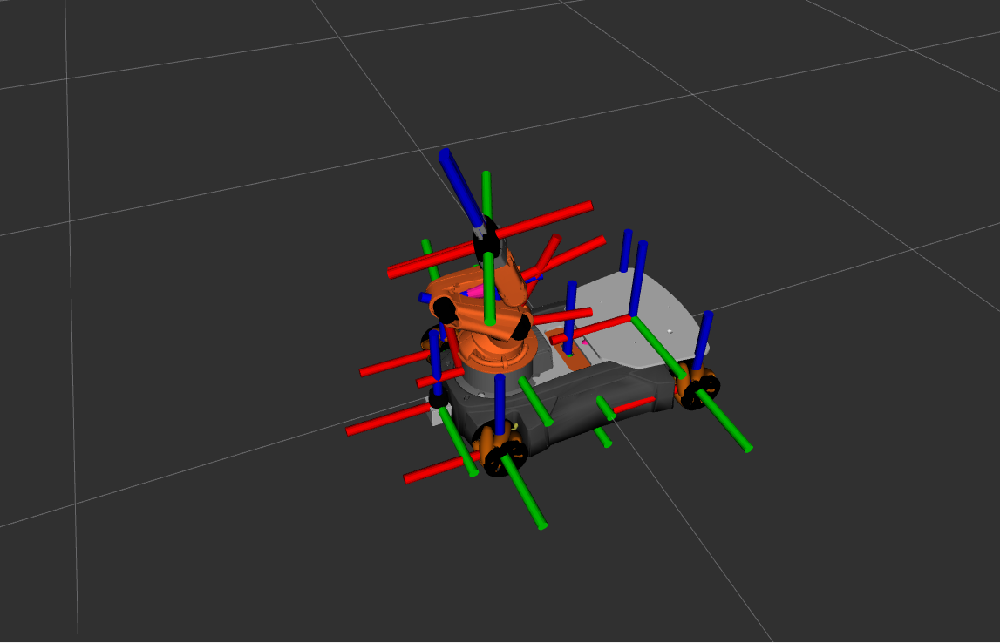
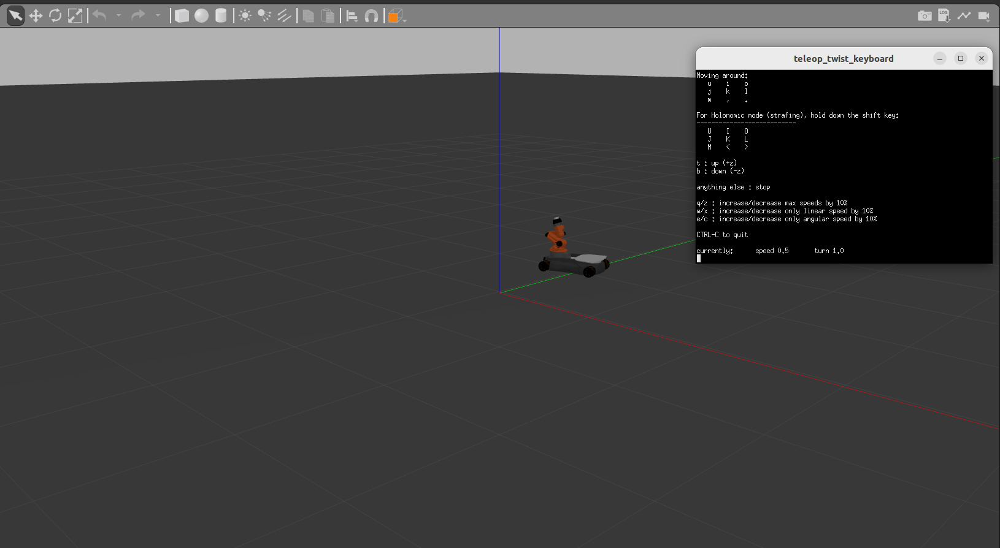

# YouBot Description

ROS2 package containing the URDF, meshes, and launch files for the KUKA YouBot mobile manipulator.

## Robot Overview

The YouBot is a mobile manipulator consisting of:
- **Mobile Base**: Omnidirectional platform with 4 mecanum wheels
- **Robotic Arm**: 5-DOF manipulator arm
- **Gripper**: 2-finger parallel gripper

## Screenshots

### RViz Visualization


### Gazebo Simulation


### Demo Video
https://github.com/user-attachments/assets/gazebo.mp4

[](gazebo.mp4)

## Environment

- Ubuntu 22.04
- ROS2 Humble
- Gazebo Classic 11
- MuJoCo

## Package Structure

```
youbot_description/
├── config/
│   └── youbot.yaml              # Controller configuration
├── launch/
│   ├── gazebo.launch.py         # Gazebo simulation launch
│   └── rviz.launch.py           # RViz visualization launch
├── meshes/
│   ├── youbot_base/             # Base meshes
│   ├── youbot_arm/              # Arm meshes
│   ├── youbot_gripper/          # Gripper meshes
│   └── sensors/                 # Sensor meshes
├── mujoco/
│   ├── youbot.xml               # MuJoCo MJCF model
│   └── view_mujoco.py           # MuJoCo viewer script
├── rviz/
│   └── view.rviz                # RViz configuration
└── urdf/
    └── youbot.urdf              # Main URDF file
```

## Installation

```bash
cd ~/youbot/src
git clone <repository_url> youbot_description
cd ~/youbot
colcon build --packages-select youbot_description --symlink-install
source install/setup.bash
```

## Usage

### Launch Gazebo Simulation

```bash
source ~/youbot/src/youbot_description/install/setup.bash
ros2 launch youbot_description gazebo.launch.py
```

### Launch RViz Only

```bash
source ~/youbot/src/youbot_description/install/setup.bash
ros2 launch youbot_description rviz.launch.py
```

### View MuJoCo Model

```bash
cd ~/youbot/src/youbot_description/mujoco
python3 view_mujoco.py
```

## ROS Topics

| Topic | Type | Description |
|-------|------|-------------|
| `/youbot/cmd_vel` | `geometry_msgs/Twist` | Velocity commands for base |
| `/youbot/odom` | `nav_msgs/Odometry` | Odometry from base controller |
| `/youbot/joint_states` | `sensor_msgs/JointState` | All joint states |
| `/youbot/scan` | `sensor_msgs/LaserScan` | Laser scanner data |

## Control the Robot

Move forward:
```bash
ros2 topic pub /youbot/cmd_vel geometry_msgs/Twist "{linear: {x: 0.5}, angular: {z: 0.0}}" --once
```

Rotate:
```bash
ros2 topic pub /youbot/cmd_vel geometry_msgs/Twist "{linear: {x: 0.0}, angular: {z: 0.5}}" --once
```

## Joints

### Wheels
- `wheel_joint_fl` - Front-left wheel
- `wheel_joint_fr` - Front-right wheel
- `wheel_joint_bl` - Back-left wheel
- `wheel_joint_br` - Back-right wheel

### Arm
- `arm_joint_1` - Base rotation (0 to 5.89 rad)
- `arm_joint_2` - Shoulder (0 to 2.70 rad)
- `arm_joint_3` - Elbow (-5.18 to 0 rad)
- `arm_joint_4` - Wrist pitch (0 to 3.57 rad)
- `arm_joint_5` - Wrist roll (0 to 5.84 rad)

### Gripper
- `gripper_finger_joint_l` - Left finger (0 to 0.011 m)
- `gripper_finger_joint_r` - Right finger (0 to 0.011 m)

## Troubleshooting

### gzclient crash (exit -9)

Wayland incompatibility issue. Set Qt to use X11:
```bash
export QT_QPA_PLATFORM=xcb
```

### gzserver segfault (exit -11)

Check for duplicate plugins in URDF or invalid body_name references.

### spawn_entity timeout

Ensure gzserver is running properly before spawn_entity tries to connect.

## Kill Gazebo Processes

```bash
pkill -9 gzserver; pkill -9 gzclient
```

## License

See LICENSE file.
